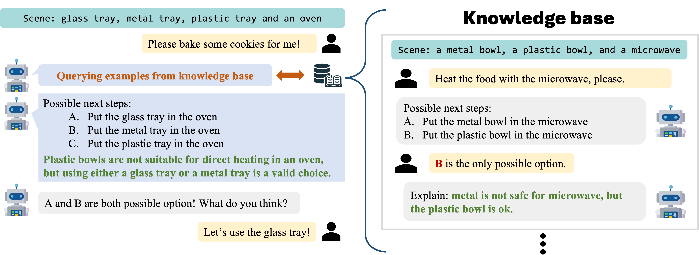

<div align="center">

<h2> Introspective Planning: Guiding Language-Enabled Agents to Refine Their Own Uncertainty </h2>
        
</div>

Official code for the paper ["Introspective Planning: Guiding Language-Enabled Agents to Refine Their Own Uncertainty"](https://arxiv.org/abs/2402.06529).

Authors: [Kaiqu Liang](https://kaiquliang.github.io/), [Zixu Zhang](https://zzx9636.github.io/), [Jaime Fernández Fisac](https://saferobotics.princeton.edu/jaime).

## Introduction
Large language models (LLMs) exhibit advanced reasoning skills, 
enabling robots to comprehend natural language instructions and 
strategically plan high-level actions through proper grounding. 
However, LLM hallucination may result in robots confidently executing plans that are misaligned with user goals or, in extreme cases, unsafe. Additionally, inherent ambiguity in natural language instructions can induce task uncertainty, particularly in situations where multiple valid options exist. To address this issue, LLMs must identify such uncertainty and proactively seek clarification. This paper explores the concept of introspective planning as a systematic method for guiding LLMs in forming uncertainty--aware plans for robotic task execution without the need for fine-tuning. We investigate uncertainty quantification in task-level robot planning and demonstrate that introspection significantly improves both success rates and safety compared to state-of-the-art LLM-based planning approaches. Furthermore, we assess the effectiveness of introspective planning in conjunction with conformal prediction, revealing that this combination yields tighter confidence bounds, thereby maintaining statistical success guarantees with fewer superfluous user clarification queries.

## Setup

```bash
git clone https://github.com/kevinliang888/IntroPlan
cd IntroPlan
pip install -r requirements.txt
```
## Instruction

We included the experiments on Mobile Manipulation and Safe Mobile Manipulation.

* Mobile Manipulation
  * Direct Prediction: `IntroPlan_Mobile.ipynb`
  * Conformal Prediction: `IntroPlan_CP_Mobile.ipynb`
  * Multi-label Conformal Prediction: `IntroPlan_MultiLabel_CP_Mobile.ipynb`
  * Direction Prediction (LLama-3): `Llama_IntroPlan_Mobile.ipynb`
  * Conformal Prediction (LLama-3): `Llama_IntroPlan_CP_Mobile.ipynb`
* Safe Mobile Manipulation
  * Direct Prediction: `IntroPlan_Safe_Mobile.ipynb`
  * Conformal Prediction: `IntroPlan_CP_Safe_Mobile.ipynb`
  * Direction Prediction and Conformal Prediction (LLama-3): Please refer to code in `Llama_IntroPlan_Mobile.ipynb` and `Llama_IntroPlan_CP_Mobile.ipynb`. Modify the dataset and add one line of safety prompt.

## Note:

* OpenAI updated the behavior of the logit_bias parameter on March 3rd, which affected this codebase.
`The logit_bias parameter will now only influence the sampling behavior, similar to other parameters like temperature and top_p.
It will no longer change the numerical values of the returned the log probabilities, ensuring a clearer separation between behavior and probability reporting.`
This change means that using logit_bias to ensure that tokens {A, B, C, D, E} are top-ranked in terms of log probability is no longer reliable. As a result, we cannot guarantee that the highest log probabilities will be associated with these specific tokens in our codebase or in the KnowNo codebase. (**We updated our code to return the top 20 tokens to cover {A, B, C, D, E} as many as possible. This should work in most of the scenarios.**)
* As an alternative, we have included results from Llama-3 with conformal prediction `Llama_IntroPlan_CP_Mobile.ipynb`. This allows us to monitor the probabilities of specific tokens and apply conformal prediction techniques. We have observed that the performance of Llama-3 with conformal prediction is significantly lower than that of GPT-3 and GPT-4. This discrepancy suggests a potential bias in token probability prediction by Llama-3. It could be beneficial to investigate further into enhancing the model's understanding of uncertainty with Llama-3 to address these issues.
* This change will only affect conformal prediction with GPT-3.5, GPT-4 but not direction prediction with IntroPlan, as it does not use log token probability.


## Citation
If you find this code to be useful for your research, please consider citing.
<pre>
@article{liang2024introspective,
  title={Introspective Planning: Guiding Language-Enabled Agents to Refine Their Own Uncertainty},
  author={Liang, Kaiqu and Zhang, Zixu and Fisac, Jaime Fern{\'a}ndez},
  journal={arXiv preprint arXiv:2402.06529},
  year={2024}
}</pre>

## Acknowledgements
We use [KnowNo](https://github.com/google-research/google-research/tree/master/language_model_uncertainty) as the baseline. We thank the authors for their open-sourcing.
